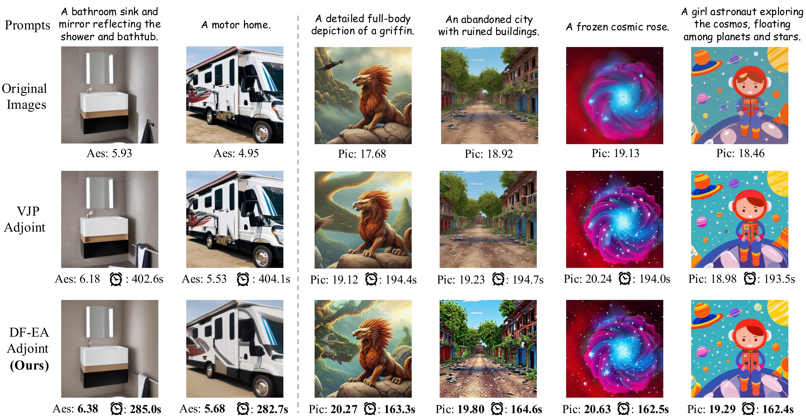

# DiffusionFisher

<div align="center">

This repository is the official implementation of the **ICML 2025** paper:
_"Efficiently Access Diffusion Fisher: Within the Outer Product Span Space"_ 

> **Fangyikang Wang<sup>1,2</sup>, Hubery Yin<sup>2,</sup>, Shaobin Zhuang<sup>2,3</sup>, Huminhao Zhu<sup>1</sup>, <br> Yinan Li<sup>1</sup>, Lei Qian<sup>1</sup>, Chao Zhang<sup>1</sup>, Hanbin Zhao<sup>1</sup>, Hui Qian<sup>1</sup>, Chen Li<sup>2</sup>**
> 
> <sup>1</sup>Zhejiang University <sup>2</sup>WeChat Vision, Tencent Inc. <sup>3</sup>Shanghai Jiao Tong University  

[](https://www.arxiv.org/abs/2505.23264)&nbsp;
[](https://opensource.org/licenses/MIT)&nbsp;




</div>


## 🆕 What's New?
### We derived the analytical formulation of [Fisher information](https://en.wikipedia.org/wiki/Fisher_information) in diffusion models.

Let us define the Fisher information of diffused distributions as follows:
```math
F_t(x_t, t) := - \frac{\partial^2}{\partial x_t^2} \log q_t(x_t, t)
```
We have the following analytical formulation for $F_t(x_t, t)$:
```math
F_t({x}_t, t) = \frac{1}{\sigma_t^2} {I} - \frac{\alpha_t^2}{\sigma_t^4} \left[ 
    \int w({y}) {y} {y}^\top \, \mathrm{d}q_0
    - \left( \int w({y}) {y} \, \mathrm{d}q_0 \right) \left( \int w({y}) {y} \, \mathrm{d}q_0 \right)^\top
\right]
```
where we define $v(x_t, t, y)$ as $\exp(-\frac{|x_t - \alpha_t y|^2}{2\sigma_t^2})\in \mathbb{R}$ and $w(x_t, t, y)$ as $\frac{v(x_t, t, y)}{\int_{\mathbb{R}^d}  v(x_t, t, y)\textnormal{d} q_0(y)} \in \mathbb{R}$


## 🪪 License
This project is licensed under the MIT License - see the [LICENSE](LICENSE.txt) file for details.


## 📝 Citation
If our work assists your research, feel free to give us a star ⭐ or cite us using:
```
@misc{wang2025efficientlyaccessdiffusionfisher,
      title={Efficiently Access Diffusion Fisher: Within the Outer Product Span Space}, 
      author={Fangyikang Wang and Hubery Yin and Shaobin Zhuang and Huminhao Zhu and Yinan Li and Lei Qian and Chao Zhang and Hanbin Zhao and Hui Qian and Chen Li},
      year={2025},
      eprint={2505.23264},
      archivePrefix={arXiv},
      primaryClass={cs.LG},
      url={https://arxiv.org/abs/2505.23264}, 
}
```

## 📩 Contact me
My e-mail address:
```
wangfangyikang@zju.edu.cn
```